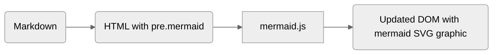

# I am a slide

Note:
No text in this slide

# I am another slide

I have text

# I am a slide with a mermaid block

```mermaid
%%{init: {'theme': 'neutral' } }%%
graph LR
      A(Markdown) --> B(HTML with pre.mermaid) --> C[mermaid.js] --> D(Updated DOM with mermaid SVG graphic)
```