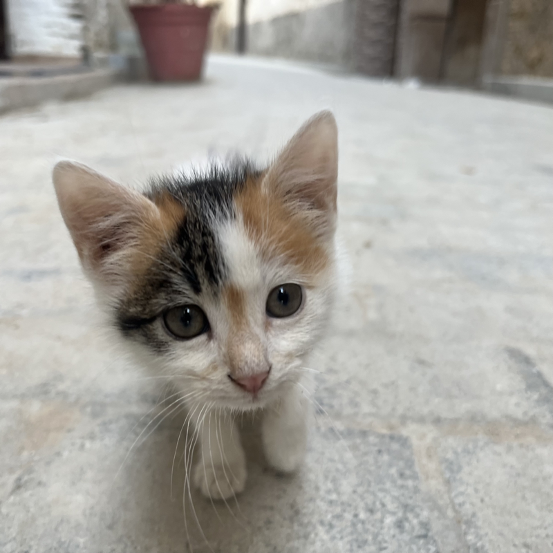
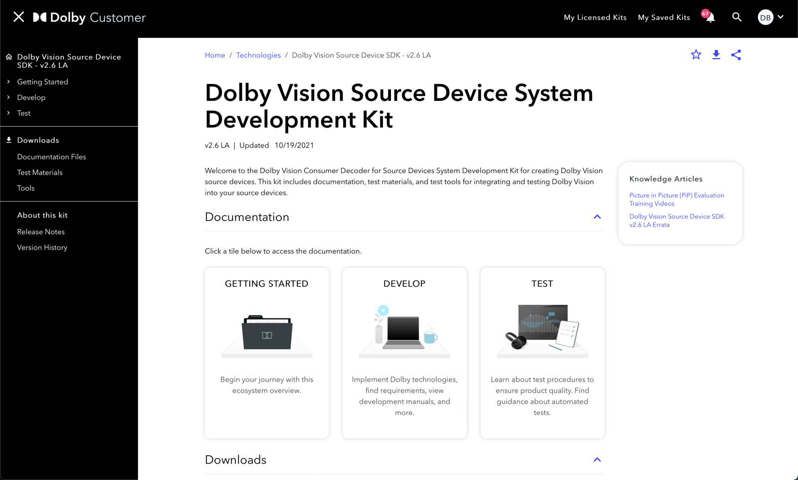
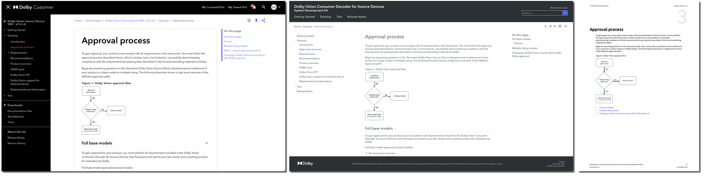
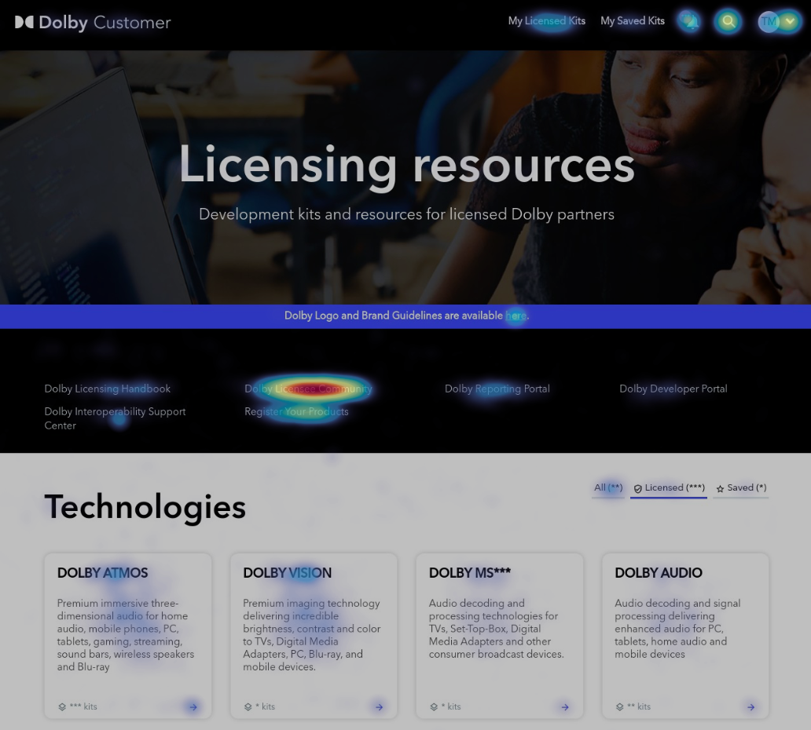
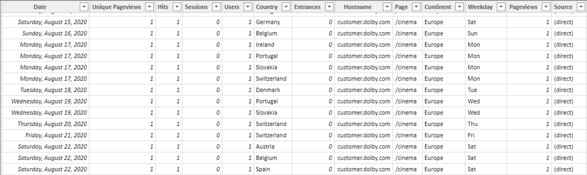
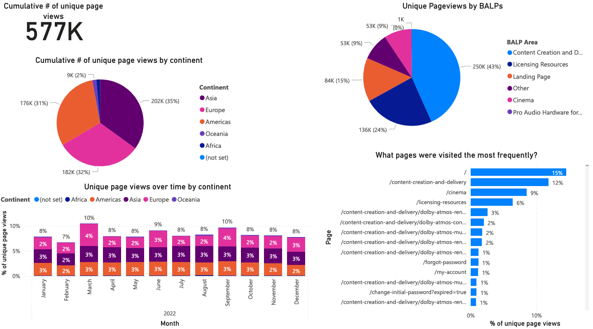
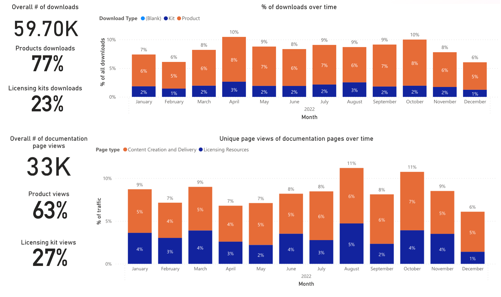

Note:
New slides start after three empty lines.
Notes are only visible in speaker mode, press "s" to access it. 

Note:
DANIEL - it's important for us to set the right tone for this presentation 

Note:
DANIEL - because we are going to be talking about technical stuff

Note:
DANIEL - running the technical part of content operations at Dolby is keeping multiple spinning plates from falling

Note:
DANIEL - we enable content operations allowing teams to publish content in our Dolby Customer portal

Note:
DANIEL - our customers are partners who license our technologies to integrate them into their products, or customers who use our software tools (like Atmos Renderer). Both technologies and products need documentation.

Note:
DANIEL - we provide online and offline outputs: Dolby Customer pages, offline static HTML pages, and PDF

### DITA-OT publishing in GitLab

<pre class="mermaid">
%%{init: {'theme': 'neutral' } }%%
graph LR
    oxygen(Writer: Oxygen XML editor) --> XML & MD
    vscode(Engineer: VS Code editor) --> MD

    subgraph GitLab
        XML("DITA XML files") --> DITA("DITA-OT docker")
        MD("Markdown files") --> DITA
    end
    DITA --> PDF & HTML & DBCU[Dolby Customer]
</pre>

Note:
MARTA - we moved from closed CMS to corporate GitLab to allow better collaboration with Engineering teams

### Slingshots + Publishing-as-a-Service

<pre class="mermaid">
%%{init: {'theme': 'neutral' } }%%
graph LR
    oxygen(Writer: Oxygen XML editor) --> XML & MD
    vscode(Engineer: VS Code editor) --> MD & PaaS

    subgraph GitLab
        XML("DITA XML files") --> DITA("DITA-OT docker")
        MD("Markdown files") --> DITA
        PaaS("PaaS - Markdown files") --> DITA

    end
    DITA --> PDF & HTML & DBCU[Dolby Customer]
    DITA --> slingshot(Slingshot - JFrog or GitLab)
</pre>

Note:
MARTA - moving to GitLab allowed us to add more collaboration methods: PaaS repos and various Slingshots

### The promise of Markdown + DITA

* Collaborarion: expectations vs. reality
* Markdown, the lesser evil (*mind the flavours*)
* Testing all new goodies for both source formats
* Decisions for compatibility - examples: 
    * Equations: MathML as external files
    * Diagrams: Mermaid (*ask Daniel on a coffee break*)

Note:
MARTA - Tech Comms collaborate with Eng, but how do we know if our customers and partners are happy with the outcome...?
THIS SHOULD BE THE PPT HALF POINT

Note:
DANIEL - We need data to understand what customers do, and use that insights to prioritize and make decisions

Note:
DANIEL - We use Google Analytics/Tag Manager, Hotjar and custom reports from our CMS

### Data Analytics infrastructure

<pre class="mermaid">
%%{init: {'theme': 'neutral' } }%%
flowchart LR
    subgraph Data Collection
        IGX("Ingeniux CMS") -->|Nightly Build| AWS("MySQL database")
        SF("SalesForce") -->|Nightly Build| AWS
        GA("Google Analytics")
    end
    subgraph Data Visualisation
        AWS --> PBID("Power BI Desktop") --> PBIS("Power BI Service")
        GA --> PBID
    end
</pre>

Note:
JAKUB

### Pipeline

Note:
JAKUB

### So why all that effort?

Note:
JAKUB

Note:
JAKUB - 

Note:
JAKUB -

### What sort of questions do we actually answer?

* How are people accessing my documentation?
* Which pages are visited the most frequently?
* What's more popular between online docs and downloading a deliverable?

Note:
JAKUB - From our Tech Writers we get the most interest around navigation flows and documentation pages popularity.

Note:
DANIEL - Summary: we wear many hats, we learn and experiment a lot

Note:
DANIEL - capturing this data allows us to check our assumptions re: how customers use our materials

Note:
DANIEL

## Data guides ContentOps <!-- .element: class="fragment" -->

### Start from questions, not data sources <!-- .element: class="fragment" -->

Note:
DANIEL -- We'll be happy to take your questions, and feel free to come to us during breaks