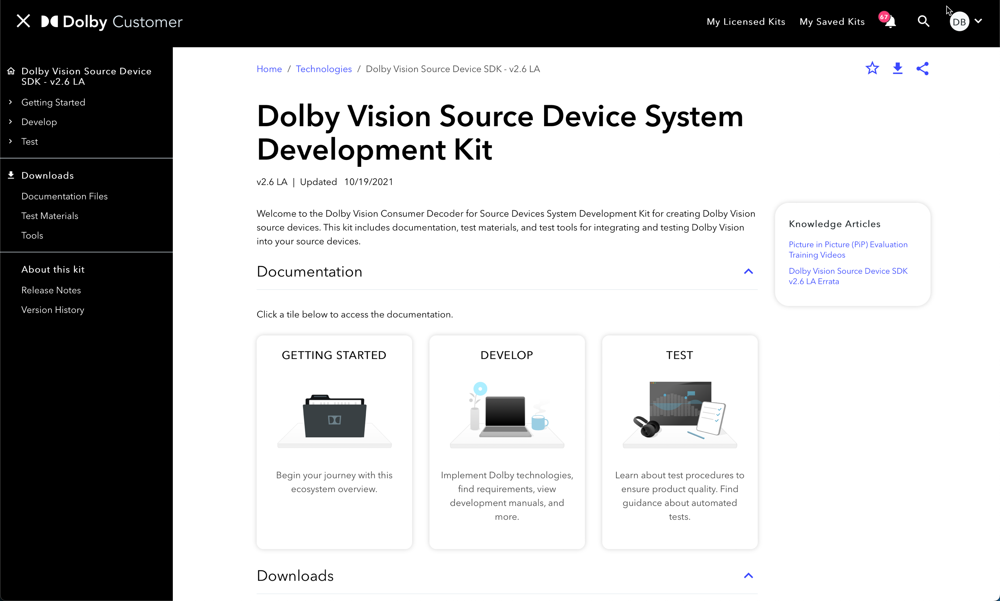

Note:
New slides start after three empty lines.
Notes are only visible in speaker mode, press "s" to access it. 

Note:
DANIEL - we enable content operations allowing teams to publish content in our Dolby Customer portal

Note:
DANIEL - our customers are partners who license our technologies to integrate them into their products, or customers who use our software tools (like Atmos Renderer). Both technologies and products need documentation.

Note:
DANIEL - we provide online and offline outputs: Dolby Customer pages, offline static HTML pages, and PDF

### DITA-OT publishing in GitLab

<pre class="mermaid">
%%{init: {'theme': 'neutral' } }%%
graph LR
    oxygen(Writer: Oxygen XML editor) --> XML & MD
    vscode(Engineer: VS Code editor) --> MD

    subgraph GitLab
        XML("DITA XML files") --> DITA("DITA-OT docker")
        MD("Markdown files") --> DITA
    end
    DITA --> PDF & HTML & DBCU[Dolby Customer]
</pre>

Note:
MARTA - we moved from closed CMS to corporate GitLab to allow better collaboration with Engineering teams

### Slingshots + Publishing-as-a-Service

<pre class="mermaid">
%%{init: {'theme': 'neutral' } }%%
graph LR
    oxygen(Writer: Oxygen XML editor) --> XML & MD
    vscode(Engineer: VS Code editor) --> MD & PaaS

    subgraph GitLab
        XML("DITA XML files") --> DITA("DITA-OT docker")
        MD("Markdown files") --> DITA
        PaaS("PaaS - Markdown files") --> DITA

    end
    DITA --> PDF & HTML & DBCU[Dolby Customer]
    DITA --> slingshot(Slingshot - JFrog or GitLab)
</pre>

Note:
MARTA - moving to GitLab allowed us to add more collaboration methods: PaaS repos and various Slingshots

### The promise of Markdown + DITA

* Collaborarion: expectations vs. reality
* Markdown, the lesser evil (*mind the flavours*)
* Testing all new goodies for both source formats
* Decisions for compatibility - examples: 
    * Equations: MathML as external files
    * Diagrams: Mermaid (*ask Daniel on a coffee break*)

Note:
MARTA
THIS SHOULD BE THE PPT HALF POINT

### Data analytics intro

Note:
DANIEL

### Data Analytics infrastructure

<pre class="mermaid">
%%{init: {'theme': 'neutral' } }%%
flowchart LR
    subgraph Data Collection
        IGX("Ingeniux CMS") -->|Nightly Build| AWS("MySQL database")
        SF("SalesForce") -->|Nightly Build| AWS
        GA("Google Analytics")
    end
    subgraph Data Visualisation
        AWS --> PBID("Power BI Desktop") --> PBIS("Power BI Service")
        GA --> PBID
    end
</pre>

Note:
JAKUB

### Pipeline

Note:
JAKUB

### Analytics presentation (visualization)

Note:
JAKUB

Note:
DANIEL - Summary: we wear many hats, we learn and experiment a lot

### Wrapping-up: things we learned (analytics)

Note:
DANIEL

### Wrapping-up: things we learned (download pain)

Note:
DANIEL

### Wrapping-up: summary

Lesson learned: better to start from questions than from data sources
Lesson learned: customers still need offline. we need to keep an ear to the ground.

Note:
DANIEL