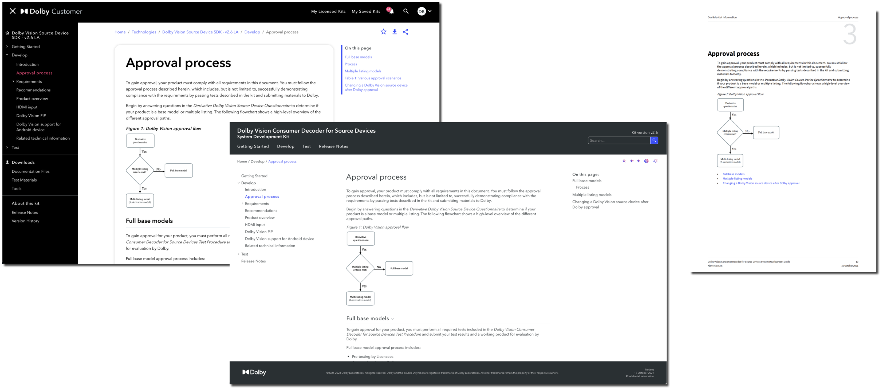
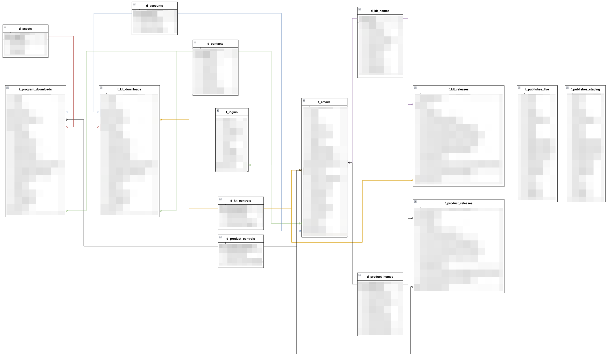

Note:
New slides start after three empty lines.
Notes are only visible in speaker mode, press "s" to access it. 

Note:
DANIEL - it's important for us to set the right tone for this presentation 

Note:
DANIEL - because we are going to be talking about technical stuff

Note:
DANIEL - running the technical part of content operations at Dolby is keeping multiple spinning plates from falling

Note:
DANIEL - we enable content operations allowing teams to publish content in our Dolby Customer portal

Note:
DANIEL - our customers are partners who license our technologies to integrate them into their products, or customers who use our software tools (like Atmos Renderer). Both technologies and products need documentation.

Note:
DANIEL - we provide online and offline outputs: Dolby Customer pages, offline static HTML pages, and PDF

<!-- .slide: data-background="#000000" -->
### How does it work?

Note:
DANIEL >> MARTA

### DITA-OT publishing in GitLab

<svg aria-roledescription="flowchart-v2" role="graphics-document document" viewBox="-8 -8 1023.0263671875 317.57122802734375" style="max-width: 1023.0263671875px;" xmlns:xlink="http://www.w3.org/1999/xlink" xmlns="http://www.w3.org/2000/svg" width="100%" id="mermaid-1685013992981"><g><marker orient="auto" markerHeight="12" markerWidth="12" markerUnits="userSpaceOnUse" refY="5" refX="10" viewBox="0 0 12 20" class="marker flowchart" id="flowchart-pointEnd"><path style="stroke-width: 1; stroke-dasharray: 1, 0;" class="arrowMarkerPath" d="M 0 0 L 10 5 L 0 10 z"></path></marker><marker orient="auto" markerHeight="12" markerWidth="12" markerUnits="userSpaceOnUse" refY="5" refX="0" viewBox="0 0 10 10" class="marker flowchart" id="flowchart-pointStart"><path style="stroke-width: 1; stroke-dasharray: 1, 0;" class="arrowMarkerPath" d="M 0 5 L 10 10 L 10 0 z"></path></marker><marker orient="auto" markerHeight="11" markerWidth="11" markerUnits="userSpaceOnUse" refY="5" refX="11" viewBox="0 0 10 10" class="marker flowchart" id="flowchart-circleEnd"><circle style="stroke-width: 1; stroke-dasharray: 1, 0;" class="arrowMarkerPath" r="5" cy="5" cx="5"></circle></marker><marker orient="auto" markerHeight="11" markerWidth="11" markerUnits="userSpaceOnUse" refY="5" refX="-1" viewBox="0 0 10 10" class="marker flowchart" id="flowchart-circleStart"><circle style="stroke-width: 1; stroke-dasharray: 1, 0;" class="arrowMarkerPath" r="5" cy="5" cx="5"></circle></marker><marker orient="auto" markerHeight="11" markerWidth="11" markerUnits="userSpaceOnUse" refY="5.2" refX="12" viewBox="0 0 11 11" class="marker cross flowchart" id="flowchart-crossEnd"><path style="stroke-width: 2; stroke-dasharray: 1, 0;" class="arrowMarkerPath" d="M 1,1 l 9,9 M 10,1 l -9,9"></path></marker><marker orient="auto" markerHeight="11" markerWidth="11" markerUnits="userSpaceOnUse" refY="5.2" refX="-1" viewBox="0 0 11 11" class="marker cross flowchart" id="flowchart-crossStart"><path style="stroke-width: 2; stroke-dasharray: 1, 0;" class="arrowMarkerPath" d="M 1,1 l 9,9 M 10,1 l -9,9"></path></marker><g class="root"><g class="clusters"><g id="GitLab" class="cluster default"><rect height="295.4759979248047" width="444.151611328125" y="0" x="336.68658447265625" ry="0" rx="0" style=""></rect><g transform="translate(525.0362396240234, 0)" class="cluster-label"><foreignObject height="37.190399169921875" width="67.45230102539062">
GitLab
</foreignObject></g></g></g><g class="edgePaths"><path marker-end="url(#flowchart-pointEnd)" style="fill:none;" class="edge-thickness-normal edge-pattern-solid flowchart-link LS-oxygen LE-XML" id="L-oxygen-XML-0" d="M286.687,62.58L290.853,62.333C295.02,62.085,303.353,61.59,311.687,61.343C320.02,61.095,328.353,61.095,337.406,61.095C346.458,61.095,356.229,61.095,361.115,61.095L366,61.095"></path><path marker-end="url(#flowchart-pointEnd)" style="fill:none;" class="edge-thickness-normal edge-pattern-solid flowchart-link LS-oxygen LE-MD" id="L-oxygen-MD-0" d="M197.15,97.19L216.24,106.448C235.329,115.706,273.508,134.222,296.764,143.48C320.02,152.738,328.353,152.738,344.917,161.996C361.481,171.254,386.276,189.77,398.673,199.028L411.071,208.286"></path><path marker-end="url(#flowchart-pointEnd)" style="fill:none;" class="edge-thickness-normal edge-pattern-solid flowchart-link LS-vscode LE-MD" id="L-vscode-MD-0" d="M278.797,254.928L284.279,254.928C289.76,254.928,300.723,254.928,310.372,254.928C320.02,254.928,328.353,254.928,336.687,254.145C345.02,253.362,353.353,251.796,357.52,251.013L361.687,250.23"></path><path marker-end="url(#flowchart-pointEnd)" style="fill:none;" class="edge-thickness-normal edge-pattern-solid flowchart-link LS-XML LE-DITA" id="L-XML-DITA-0" d="M526.029,61.095L530.915,61.095C535.8,61.095,545.572,61.095,564.424,73.686C583.277,86.278,611.21,111.46,625.177,124.052L639.144,136.643"></path><path marker-end="url(#flowchart-pointEnd)" style="fill:none;" class="edge-thickness-normal edge-pattern-solid flowchart-link LS-MD LE-DITA" id="L-MD-DITA-0" d="M530.343,234.381L534.51,234.381C538.676,234.381,547.01,234.381,563.123,226.79C579.236,219.198,603.13,204.016,615.077,196.424L627.023,188.833"></path><path marker-end="url(#flowchart-pointEnd)" style="fill:none;" class="edge-thickness-normal edge-pattern-solid flowchart-link LS-DITA LE-PDF" id="L-DITA-PDF-0" d="M692.062,136.643L706.858,120.536C721.654,104.429,751.246,72.214,770.209,56.107C789.172,40,797.505,40,816.035,40C834.566,40,863.294,40,877.657,40L892.021,40"></path><path marker-end="url(#flowchart-pointEnd)" style="fill:none;" class="edge-thickness-normal edge-pattern-solid flowchart-link LS-DITA LE-HTML" id="L-DITA-HTML-0" d="M755.838,162.738L760.005,162.738C764.172,162.738,772.505,162.738,780.838,162.738C789.172,162.738,797.505,162.738,814.596,162.738C831.686,162.738,857.535,162.738,870.459,162.738L883.383,162.738"></path><path marker-end="url(#flowchart-pointEnd)" style="fill:none;" class="edge-thickness-normal edge-pattern-solid flowchart-link LS-DITA LE-DBCU" id="L-DITA-DBCU-0" d="M694.188,188.833L708.63,203.274C723.071,217.714,751.955,246.595,770.563,261.036C789.172,275.476,797.505,275.476,805.838,275.476C814.172,275.476,822.505,275.476,826.672,275.476L830.838,275.476"></path></g><g class="edgeLabels"><g class="edgeLabel"><g transform="translate(0, 0)" class="label"><foreignObject height="0" width="0">

</foreignObject></g></g><g class="edgeLabel"><g transform="translate(0, 0)" class="label"><foreignObject height="0" width="0">

</foreignObject></g></g><g class="edgeLabel"><g transform="translate(0, 0)" class="label"><foreignObject height="0" width="0">

</foreignObject></g></g><g class="edgeLabel"><g transform="translate(0, 0)" class="label"><foreignObject height="0" width="0">

</foreignObject></g></g><g class="edgeLabel"><g transform="translate(0, 0)" class="label"><foreignObject height="0" width="0">

</foreignObject></g></g><g class="edgeLabel"><g transform="translate(0, 0)" class="label"><foreignObject height="0" width="0">

</foreignObject></g></g><g class="edgeLabel"><g transform="translate(0, 0)" class="label"><foreignObject height="0" width="0">

</foreignObject></g></g><g class="edgeLabel"><g transform="translate(0, 0)" class="label"><foreignObject height="0" width="0">

</foreignObject></g></g></g><g class="nodes"><g transform="translate(668.0905151367188, 162.73799896240234)" id="flowchart-DITA-32" class="node default default"><rect height="52.190399169921875" width="175.495361328125" y="-26.095199584960938" x="-87.7476806640625" ry="5" rx="5" style="" class="basic label-container"></rect><g transform="translate(-80.2476806640625, -18.595199584960938)" style="" class="label"><foreignObject height="37.190399169921875" width="160.495361328125">
DITA-OT docker
</foreignObject></g></g><g transform="translate(446.01470947265625, 61.09519958496094)" id="flowchart-XML-27" class="node default default"><rect height="52.190399169921875" width="160.02914428710938" y="-26.095199584960938" x="-80.01457214355469" ry="5" rx="5" style="" class="basic label-container"></rect><g transform="translate(-72.51457214355469, -18.595199584960938)" style="" class="label"><foreignObject height="37.190399169921875" width="145.02914428710938">
DITA XML files
</foreignObject></g></g><g transform="translate(446.01470947265625, 234.38079833984375)" id="flowchart-MD-28" class="node default default"><rect height="52.190399169921875" width="168.65625" y="-26.095199584960938" x="-84.328125" ry="5" rx="5" style="" class="basic label-container"></rect><g transform="translate(-76.828125, -18.595199584960938)" style="" class="label"><foreignObject height="37.190399169921875" width="153.65625">
Markdown files
</foreignObject></g></g><g transform="translate(143.34329223632812, 71.09519958496094)" id="flowchart-oxygen-26" class="node default"><rect height="52.190399169921875" width="286.68658447265625" y="-26.095199584960938" x="-143.34329223632812" ry="5" rx="5" style="" class="basic label-container"></rect><g transform="translate(-135.84329223632812, -18.595199584960938)" style="" class="label"><foreignObject height="37.190399169921875" width="271.68658447265625">
Writer: Oxygen XML editor
</foreignObject></g></g><g transform="translate(143.34329223632812, 254.92839813232422)" id="flowchart-vscode-29" class="node default default"><rect height="52.190399169921875" width="270.907470703125" y="-26.095199584960938" x="-135.4537353515625" ry="5" rx="5" style="" class="basic label-container"></rect><g transform="translate(-127.9537353515625, -18.595199584960938)" style="" class="label"><foreignObject height="37.190399169921875" width="255.907470703125">
Engineer: VS Code editor
</foreignObject></g></g><g transform="translate(918.9322967529297, 40)" id="flowchart-PDF-36" class="node default default"><rect height="52.190399169921875" width="53.82196044921875" y="-26.095199584960938" x="-26.910980224609375" ry="0" rx="0" style="" class="basic label-container"></rect><g transform="translate(-19.410980224609375, -18.595199584960938)" style="" class="label"><foreignObject height="37.190399169921875" width="38.82196044921875">
PDF
</foreignObject></g></g><g transform="translate(918.9322967529297, 162.73799896240234)" id="flowchart-HTML-37" class="node default default"><rect height="52.190399169921875" width="71.0985107421875" y="-26.095199584960938" x="-35.54925537109375" ry="0" rx="0" style="" class="basic label-container"></rect><g transform="translate(-28.04925537109375, -18.595199584960938)" style="" class="label"><foreignObject height="37.190399169921875" width="56.0985107421875">
HTML
</foreignObject></g></g><g transform="translate(918.9322967529297, 275.4759979248047)" id="flowchart-DBCU-38" class="node default default"><rect height="52.190399169921875" width="176.18820190429688" y="-26.095199584960938" x="-88.09410095214844" ry="0" rx="0" style="" class="basic label-container"></rect><g transform="translate(-80.59410095214844, -18.595199584960938)" style="" class="label"><foreignObject height="37.190399169921875" width="161.18820190429688">
Dolby Customer
</foreignObject></g></g></g></g></g></svg>

<!-- <pre class="mermaid">
%%{init: {'theme': 'neutral' } }%%
graph LR
    oxygen(Writer: Oxygen XML editor) ==> XML & MD
    vscode(Engineer: VS Code editor) ==> MD

    subgraph GitLab
        XML("DITA XML files") ==> DITA("DITA-OT docker")
        MD("Markdown files") ==> DITA
    end
    DITA ==> PDF & HTML & DBCU[Dolby Customer]
</pre> -->

Note:
MARTA - we moved from closed CMS to corporate GitLab to allow better collaboration with Engineering teams

### Slingshots + Publishing-as-a-Service

<svg aria-roledescription="flowchart-v2" role="graphics-document document" viewBox="-8 -8 1203.435546875 419.76153564453125" style="max-width: 1203.435546875px;" xmlns:xlink="http://www.w3.org/1999/xlink" xmlns="http://www.w3.org/2000/svg" width="100%" id="mermaid-1685013993221"><g><marker orient="auto" markerHeight="12" markerWidth="12" markerUnits="userSpaceOnUse" refY="5" refX="10" viewBox="0 0 12 20" class="marker flowchart" id="flowchart-pointEnd"><path style="stroke-width: 1; stroke-dasharray: 1, 0;" class="arrowMarkerPath" d="M 0 0 L 10 5 L 0 10 z"></path></marker><marker orient="auto" markerHeight="12" markerWidth="12" markerUnits="userSpaceOnUse" refY="5" refX="0" viewBox="0 0 10 10" class="marker flowchart" id="flowchart-pointStart"><path style="stroke-width: 1; stroke-dasharray: 1, 0;" class="arrowMarkerPath" d="M 0 5 L 10 10 L 10 0 z"></path></marker><marker orient="auto" markerHeight="11" markerWidth="11" markerUnits="userSpaceOnUse" refY="5" refX="11" viewBox="0 0 10 10" class="marker flowchart" id="flowchart-circleEnd"><circle style="stroke-width: 1; stroke-dasharray: 1, 0;" class="arrowMarkerPath" r="5" cy="5" cx="5"></circle></marker><marker orient="auto" markerHeight="11" markerWidth="11" markerUnits="userSpaceOnUse" refY="5" refX="-1" viewBox="0 0 10 10" class="marker flowchart" id="flowchart-circleStart"><circle style="stroke-width: 1; stroke-dasharray: 1, 0;" class="arrowMarkerPath" r="5" cy="5" cx="5"></circle></marker><marker orient="auto" markerHeight="11" markerWidth="11" markerUnits="userSpaceOnUse" refY="5.2" refX="12" viewBox="0 0 11 11" class="marker cross flowchart" id="flowchart-crossEnd"><path style="stroke-width: 2; stroke-dasharray: 1, 0;" class="arrowMarkerPath" d="M 1,1 l 9,9 M 10,1 l -9,9"></path></marker><marker orient="auto" markerHeight="11" markerWidth="11" markerUnits="userSpaceOnUse" refY="5.2" refX="-1" viewBox="0 0 11 11" class="marker cross flowchart" id="flowchart-crossStart"><path style="stroke-width: 2; stroke-dasharray: 1, 0;" class="arrowMarkerPath" d="M 1,1 l 9,9 M 10,1 l -9,9"></path></marker><g class="root"><g class="clusters"><g id="GitLab" class="cluster default"><rect height="397.66639709472656" width="514.1518249511719" y="0" x="336.68658447265625" ry="0" rx="0" style=""></rect><g transform="translate(560.0363464355469, 0)" class="cluster-label"><foreignObject height="37.190399169921875" width="67.45230102539062">
GitLab
</foreignObject></g></g></g><g class="edgePaths"><path marker-end="url(#flowchart-pointEnd)" style="fill:none;" class="edge-thickness-normal edge-pattern-solid flowchart-link LS-oxygen LE-XML" id="L-oxygen-XML-0" d="M286.687,62.58L290.853,62.333C295.02,62.085,303.353,61.59,311.687,61.343C320.02,61.095,328.353,61.095,343.239,61.095C358.124,61.095,379.562,61.095,390.281,61.095L401,61.095"></path><path marker-end="url(#flowchart-pointEnd)" style="fill:none;" class="edge-thickness-normal edge-pattern-solid flowchart-link LS-oxygen LE-MD" id="L-oxygen-MD-0" d="M229.319,97.19L243.047,101.357C256.775,105.524,284.231,113.857,302.125,118.024C320.02,122.19,328.353,122.19,347.813,129.782C367.273,137.373,397.859,152.555,413.152,160.147L428.445,167.738"></path><path marker-end="url(#flowchart-pointEnd)" style="fill:none;" class="edge-thickness-normal edge-pattern-solid flowchart-link LS-vscode LE-MD" id="L-vscode-MD-0" d="M229.319,300.476L243.047,296.309C256.775,292.143,284.231,283.809,302.125,279.643C320.02,275.476,328.353,275.476,348.886,266.218C369.419,256.96,402.151,238.444,418.518,229.186L434.884,219.928"></path><path marker-end="url(#flowchart-pointEnd)" style="fill:none;" class="edge-thickness-normal edge-pattern-solid flowchart-link LS-vscode LE-PaaS" id="L-vscode-PaaS-0" d="M278.797,334.617L284.279,334.943C289.76,335.269,300.723,335.92,310.372,336.246C320.02,336.571,328.353,336.571,336.687,336.571C345.02,336.571,353.353,336.571,357.52,336.571L361.687,336.571"></path><path marker-end="url(#flowchart-pointEnd)" style="fill:none;" class="edge-thickness-normal edge-pattern-solid flowchart-link LS-XML LE-DITA" id="L-XML-DITA-0" d="M561.029,61.095L571.748,61.095C582.467,61.095,603.905,61.095,629.721,78.869C655.537,96.643,685.731,132.19,700.828,149.964L715.925,167.738"></path><path marker-end="url(#flowchart-pointEnd)" style="fill:none;" class="edge-thickness-normal edge-pattern-solid flowchart-link LS-MD LE-DITA" id="L-MD-DITA-0" d="M565.343,193.833L575.343,193.833C585.343,193.833,605.343,193.833,619.51,193.833C633.676,193.833,642.01,193.833,646.176,193.833L650.343,193.833"></path><path marker-end="url(#flowchart-pointEnd)" style="fill:none;" class="edge-thickness-normal edge-pattern-solid flowchart-link LS-PaaS LE-DITA" id="L-PaaS-DITA-0" d="M600.343,336.571L604.51,336.571C608.676,336.571,617.01,336.571,636.532,317.131C656.055,297.69,686.767,258.809,702.122,239.369L717.478,219.928"></path><path marker-end="url(#flowchart-pointEnd)" style="fill:none;" class="edge-thickness-normal edge-pattern-solid flowchart-link LS-DITA LE-PDF" id="L-DITA-PDF-0" d="M757.216,167.738L772.82,146.448C788.424,125.159,819.631,82.579,839.401,61.29C859.172,40,867.505,40,895.236,40C922.968,40,970.097,40,993.661,40L1017.226,40"></path><path marker-end="url(#flowchart-pointEnd)" style="fill:none;" class="edge-thickness-normal edge-pattern-solid flowchart-link LS-DITA LE-HTML" id="L-DITA-HTML-0" d="M795.062,167.738L804.358,163.48C813.654,159.222,832.246,150.706,845.709,146.448C859.172,142.19,867.505,142.19,893.797,142.19C920.088,142.19,964.338,142.19,986.463,142.19L1008.588,142.19"></path><path marker-end="url(#flowchart-pointEnd)" style="fill:none;" class="edge-thickness-normal edge-pattern-solid flowchart-link LS-DITA LE-DBCU" id="L-DITA-DBCU-0" d="M774.128,219.928L786.913,229.186C799.698,238.444,825.268,256.96,842.22,266.218C859.172,275.476,867.505,275.476,885.039,275.476C902.573,275.476,929.308,275.476,942.676,275.476L956.043,275.476"></path><path marker-end="url(#flowchart-pointEnd)" style="fill:none;" class="edge-thickness-normal edge-pattern-solid flowchart-link LS-DITA LE-slingshot" id="L-DITA-slingshot-0" d="M754.095,219.928L770.219,246.218C786.343,272.508,818.591,325.087,838.881,351.377C859.172,377.666,867.505,377.666,875.838,377.666C884.172,377.666,892.505,377.666,896.672,377.666L900.838,377.666"></path></g><g class="edgeLabels"><g class="edgeLabel"><g transform="translate(0, 0)" class="label"><foreignObject height="0" width="0">

</foreignObject></g></g><g class="edgeLabel"><g transform="translate(0, 0)" class="label"><foreignObject height="0" width="0">

</foreignObject></g></g><g class="edgeLabel"><g transform="translate(0, 0)" class="label"><foreignObject height="0" width="0">

</foreignObject></g></g><g class="edgeLabel"><g transform="translate(0, 0)" class="label"><foreignObject height="0" width="0">

</foreignObject></g></g><g class="edgeLabel"><g transform="translate(0, 0)" class="label"><foreignObject height="0" width="0">

</foreignObject></g></g><g class="edgeLabel"><g transform="translate(0, 0)" class="label"><foreignObject height="0" width="0">

</foreignObject></g></g><g class="edgeLabel"><g transform="translate(0, 0)" class="label"><foreignObject height="0" width="0">

</foreignObject></g></g><g class="edgeLabel"><g transform="translate(0, 0)" class="label"><foreignObject height="0" width="0">

</foreignObject></g></g><g class="edgeLabel"><g transform="translate(0, 0)" class="label"><foreignObject height="0" width="0">

</foreignObject></g></g><g class="edgeLabel"><g transform="translate(0, 0)" class="label"><foreignObject height="0" width="0">

</foreignObject></g></g><g class="edgeLabel"><g transform="translate(0, 0)" class="label"><foreignObject height="0" width="0">

</foreignObject></g></g></g><g class="nodes"><g transform="translate(738.0907287597656, 193.83319854736328)" id="flowchart-DITA-83" class="node default default"><rect height="52.190399169921875" width="175.495361328125" y="-26.095199584960938" x="-87.7476806640625" ry="5" rx="5" style="" class="basic label-container"></rect><g transform="translate(-80.2476806640625, -18.595199584960938)" style="" class="label"><foreignObject height="37.190399169921875" width="160.495361328125">
DITA-OT docker
</foreignObject></g></g><g transform="translate(481.0148162841797, 61.09519958496094)" id="flowchart-XML-77" class="node default default"><rect height="52.190399169921875" width="160.02914428710938" y="-26.095199584960938" x="-80.01457214355469" ry="5" rx="5" style="" class="basic label-container"></rect><g transform="translate(-72.51457214355469, -18.595199584960938)" style="" class="label"><foreignObject height="37.190399169921875" width="145.02914428710938">
DITA XML files
</foreignObject></g></g><g transform="translate(481.0148162841797, 193.83319854736328)" id="flowchart-MD-78" class="node default"><rect height="52.190399169921875" width="168.65625" y="-26.095199584960938" x="-84.328125" ry="5" rx="5" style="" class="basic label-container"></rect><g transform="translate(-76.828125, -18.595199584960938)" style="" class="label"><foreignObject height="37.190399169921875" width="153.65625">
Markdown files
</foreignObject></g></g><g transform="translate(481.0148162841797, 336.5711975097656)" id="flowchart-PaaS-81" class="node default"><rect height="52.190399169921875" width="238.65646362304688" y="-26.095199584960938" x="-119.32823181152344" ry="5" rx="5" style="" class="basic label-container"></rect><g transform="translate(-111.82823181152344, -18.595199584960938)" style="" class="label"><foreignObject height="37.190399169921875" width="223.65646362304688">
PaaS - Markdown files
</foreignObject></g></g><g transform="translate(143.34329223632812, 71.09519958496094)" id="flowchart-oxygen-76" class="node default default"><rect height="52.190399169921875" width="286.68658447265625" y="-26.095199584960938" x="-143.34329223632812" ry="5" rx="5" style="" class="basic label-container"></rect><g transform="translate(-135.84329223632812, -18.595199584960938)" style="" class="label"><foreignObject height="37.190399169921875" width="271.68658447265625">
Writer: Oxygen XML editor
</foreignObject></g></g><g transform="translate(143.34329223632812, 326.5711975097656)" id="flowchart-vscode-79" class="node default default"><rect height="52.190399169921875" width="270.907470703125" y="-26.095199584960938" x="-135.4537353515625" ry="5" rx="5" style="" class="basic label-container"></rect><g transform="translate(-127.9537353515625, -18.595199584960938)" style="" class="label"><foreignObject height="37.190399169921875" width="255.907470703125">
Engineer: VS Code editor
</foreignObject></g></g><g transform="translate(1044.1370239257812, 40)" id="flowchart-PDF-89" class="node default default"><rect height="52.190399169921875" width="53.82196044921875" y="-26.095199584960938" x="-26.910980224609375" ry="0" rx="0" style="" class="basic label-container"></rect><g transform="translate(-19.410980224609375, -18.595199584960938)" style="" class="label"><foreignObject height="37.190399169921875" width="38.82196044921875">
PDF
</foreignObject></g></g><g transform="translate(1044.1370239257812, 142.19039916992188)" id="flowchart-HTML-90" class="node default default"><rect height="52.190399169921875" width="71.0985107421875" y="-26.095199584960938" x="-35.54925537109375" ry="0" rx="0" style="" class="basic label-container"></rect><g transform="translate(-28.04925537109375, -18.595199584960938)" style="" class="label"><foreignObject height="37.190399169921875" width="56.0985107421875">
HTML
</foreignObject></g></g><g transform="translate(1044.1370239257812, 275.4759979248047)" id="flowchart-DBCU-91" class="node default default"><rect height="52.190399169921875" width="176.18820190429688" y="-26.095199584960938" x="-88.09410095214844" ry="0" rx="0" style="" class="basic label-container"></rect><g transform="translate(-80.59410095214844, -18.595199584960938)" style="" class="label"><foreignObject height="37.190399169921875" width="161.18820190429688">
Dolby Customer
</foreignObject></g></g><g transform="translate(1044.1370239257812, 377.66639709472656)" id="flowchart-slingshot-93" class="node default default"><rect height="52.190399169921875" width="286.59722900390625" y="-26.095199584960938" x="-143.29861450195312" ry="5" rx="5" style="" class="basic label-container"></rect><g transform="translate(-135.79861450195312, -18.595199584960938)" style="" class="label"><foreignObject height="37.190399169921875" width="271.59722900390625">
Slingshot - JFrog or GitLab
</foreignObject></g></g></g></g></g></svg>

<!-- <pre class="mermaid">
%%{init: {'theme': 'neutral' } }%%
graph LR
    oxygen(Writer: Oxygen XML editor) ==> XML & MD
    vscode(Engineer: VS Code editor) ==> MD & PaaS

    subgraph GitLab
        XML("DITA XML files") ==> DITA("DITA-OT docker")
        MD("Markdown files") ==> DITA
        PaaS("PaaS - Markdown files") ==> DITA

    end
    DITA ==> PDF & HTML & DBCU[Dolby Customer]
    DITA ==> slingshot(Slingshot - JFrog or GitLab)
</pre> -->

Note:
MARTA - moving to GitLab allowed us to add more collaboration methods: PaaS repos and various Slingshots

### The promise of Markdown + DITA

* <!-- .element: class="fragment" -->Collaboration: expectations vs. reality 
* <!-- .element: class="fragment" -->Markdown, the lesser evil  
  (*mind the flavours*)
* <!-- .element: class="fragment" -->Testing all new goodies for both source formats
* <!-- .element: class="fragment" -->Decisions for compatibility
    * <!-- .element: class="fragment" -->Equations: MathML as external files
    * <!-- .element: class="fragment" -->Diagrams: Mermaid  
      (*ask Daniel on a coffee break*)

Note:
MARTA - Tech Comms collaborate with Eng, but how do we know if our customers and partners are happy with the outcome...?
THIS SHOULD BE THE PPT HALF POINT

Note:
DANIEL - We need data to understand what customers do, and use that insights to prioritize and make decisions

Note:
DANIEL - We use Google Analytics/Tag Manager, Hotjar and custom reports from our CMS

### Data Analytics infrastructure

<svg aria-roledescription="flowchart-v2" role="graphics-document document" viewBox="-8 -8 1108.7193603515625 291.47601318359375" style="max-width: 1108.7193603515625px;" xmlns:xlink="http://www.w3.org/1999/xlink" xmlns="http://www.w3.org/2000/svg" width="100%" id="mermaid-1685015105676"><g><marker orient="auto" markerHeight="12" markerWidth="12" markerUnits="userSpaceOnUse" refY="5" refX="10" viewBox="0 0 12 20" class="marker flowchart" id="flowchart-pointEnd"><path style="stroke-width: 1; stroke-dasharray: 1, 0;" class="arrowMarkerPath" d="M 0 0 L 10 5 L 0 10 z"></path></marker><marker orient="auto" markerHeight="12" markerWidth="12" markerUnits="userSpaceOnUse" refY="5" refX="0" viewBox="0 0 10 10" class="marker flowchart" id="flowchart-pointStart"><path style="stroke-width: 1; stroke-dasharray: 1, 0;" class="arrowMarkerPath" d="M 0 5 L 10 10 L 10 0 z"></path></marker><marker orient="auto" markerHeight="11" markerWidth="11" markerUnits="userSpaceOnUse" refY="5" refX="11" viewBox="0 0 10 10" class="marker flowchart" id="flowchart-circleEnd"><circle style="stroke-width: 1; stroke-dasharray: 1, 0;" class="arrowMarkerPath" r="5" cy="5" cx="5"></circle></marker><marker orient="auto" markerHeight="11" markerWidth="11" markerUnits="userSpaceOnUse" refY="5" refX="-1" viewBox="0 0 10 10" class="marker flowchart" id="flowchart-circleStart"><circle style="stroke-width: 1; stroke-dasharray: 1, 0;" class="arrowMarkerPath" r="5" cy="5" cx="5"></circle></marker><marker orient="auto" markerHeight="11" markerWidth="11" markerUnits="userSpaceOnUse" refY="5.2" refX="12" viewBox="0 0 11 11" class="marker cross flowchart" id="flowchart-crossEnd"><path style="stroke-width: 2; stroke-dasharray: 1, 0;" class="arrowMarkerPath" d="M 1,1 l 9,9 M 10,1 l -9,9"></path></marker><marker orient="auto" markerHeight="11" markerWidth="11" markerUnits="userSpaceOnUse" refY="5.2" refX="-1" viewBox="0 0 11 11" class="marker cross flowchart" id="flowchart-crossStart"><path style="stroke-width: 2; stroke-dasharray: 1, 0;" class="arrowMarkerPath" d="M 1,1 l 9,9 M 10,1 l -9,9"></path></marker><g class="root"><g class="clusters"><g id="subGraph1" class="cluster default"><rect height="193.2855987548828" width="478.5035400390625" y="61.642799377441406" x="614.2158203125" ry="0" rx="0" style=""></rect><g transform="translate(762.0784454345703, 61.642799377441406)" class="cluster-label"><foreignObject height="37.190399169921875" width="182.77828979492188">
Data Visualisation
</foreignObject></g></g><g id="subGraph0" class="cluster default"><rect height="275.4759979248047" width="564.2158203125" y="0" x="0" ry="0" rx="0" style=""></rect><g transform="translate(203.24594116210938, 0)" class="cluster-label"><foreignObject height="37.190399169921875" width="157.72393798828125">
Data Collection
</foreignObject></g></g></g><g class="edgePaths"><path marker-end="url(#flowchart-pointEnd)" style="fill:none;" class="edge-thickness-normal edge-pattern-solid flowchart-link LS-IGX LE-AWS" id="L-IGX-AWS-0" d="M173.675,61.095L188.726,61.095C203.778,61.095,233.88,61.095,264.403,65.421C294.926,69.746,325.87,78.397,341.342,82.722L356.814,87.047"></path><path marker-end="url(#flowchart-pointEnd)" style="fill:none;" class="edge-thickness-normal edge-pattern-solid flowchart-link LS-SF LE-AWS" id="L-SF-AWS-0" d="M161.103,163.286L178.25,163.286C195.396,163.286,229.689,163.286,262.308,158.96C294.926,154.635,325.87,145.984,341.342,141.659L356.814,137.333"></path><path marker-end="url(#flowchart-pointEnd)" style="fill:none;" class="edge-thickness-normal edge-pattern-solid flowchart-link LS-AWS LE-PBID" id="L-AWS-PBID-0" d="M536.69,112.19L541.278,112.19C545.865,112.19,555.041,112.19,563.795,112.19C572.549,112.19,580.882,112.19,589.216,112.19C597.549,112.19,605.882,112.19,619.957,116.357C634.031,120.524,653.847,128.857,663.755,133.024L673.663,137.19"></path><path marker-end="url(#flowchart-pointEnd)" style="fill:none;" class="edge-thickness-normal edge-pattern-solid flowchart-link LS-PBID LE-PBIS" id="L-PBID-PBIS-0" d="M832.211,163.286L836.378,163.286C840.545,163.286,848.878,163.286,857.211,163.286C865.545,163.286,873.878,163.286,878.045,163.286L882.211,163.286"></path><path marker-end="url(#flowchart-pointEnd)" style="fill:none;" class="edge-thickness-normal edge-pattern-solid flowchart-link LS-GA LE-PBID" id="L-GA-PBID-0" d="M539.216,214.381L543.382,214.381C547.549,214.381,555.882,214.381,564.216,214.381C572.549,214.381,580.882,214.381,589.216,214.381C597.549,214.381,605.882,214.381,619.957,210.214C634.031,206.047,653.847,197.714,663.755,193.547L673.663,189.381"></path></g><g class="edgeLabels"><g transform="translate(263.9820556640625, 61.09519958496094)" class="edgeLabel"><g transform="translate(-65.30670166015625, -18.595199584960938)" class="label"><foreignObject height="37.190399169921875" width="130.6134033203125">
Nightly Build
</foreignObject></g></g><g transform="translate(263.9820556640625, 163.2855987548828)" class="edgeLabel"><g transform="translate(-65.30670166015625, -18.595199584960938)" class="label"><foreignObject height="37.190399169921875" width="130.6134033203125">
Nightly Build
</foreignObject></g></g><g class="edgeLabel"><g transform="translate(0, 0)" class="label"><foreignObject height="0" width="0">

</foreignObject></g></g><g class="edgeLabel"><g transform="translate(0, 0)" class="label"><foreignObject height="0" width="0">

</foreignObject></g></g><g class="edgeLabel"><g transform="translate(0, 0)" class="label"><foreignObject height="0" width="0">

</foreignObject></g></g></g><g class="nodes"><g transform="translate(974.9652862548828, 163.2855987548828)" id="flowchart-PBIS-122" class="node default default"><rect height="52.190399169921875" width="185.50814819335938" y="-26.095199584960938" x="-92.75407409667969" ry="5" rx="5" style="" class="basic label-container"></rect><g transform="translate(-85.25407409667969, -18.595199584960938)" style="" class="label"><foreignObject height="37.190399169921875" width="170.50814819335938">
Power BI Service
</foreignObject></g></g><g transform="translate(735.7135162353516, 163.2855987548828)" id="flowchart-PBID-121" class="node default default"><rect height="52.190399169921875" width="192.99539184570312" y="-26.095199584960938" x="-96.49769592285156" ry="5" rx="5" style="" class="basic label-container"></rect><g transform="translate(-88.99769592285156, -18.595199584960938)" style="" class="label"><foreignObject height="37.190399169921875" width="177.99539184570312">
Power BI Desktop
</foreignObject></g></g><g transform="translate(446.7522888183594, 112.19039916992188)" id="flowchart-AWS-116" class="node default"><rect height="52.190399169921875" width="179.87594604492188" y="-26.095199584960938" x="-89.93797302246094" ry="5" rx="5" style="" class="basic label-container"></rect><g transform="translate(-82.43797302246094, -18.595199584960938)" style="" class="label"><foreignObject height="37.190399169921875" width="164.87594604492188">
MySQL database
</foreignObject></g></g><g transform="translate(99.33767700195312, 61.09519958496094)" id="flowchart-IGX-115" class="node default default"><rect height="52.190399169921875" width="148.67535400390625" y="-26.095199584960938" x="-74.33767700195312" ry="5" rx="5" style="" class="basic label-container"></rect><g transform="translate(-66.83767700195312, -18.595199584960938)" style="" class="label"><foreignObject height="37.190399169921875" width="133.67535400390625">
Ingeniux CMS
</foreignObject></g></g><g transform="translate(99.33767700195312, 163.2855987548828)" id="flowchart-SF-117" class="node default default"><rect height="52.190399169921875" width="123.53158569335938" y="-26.095199584960938" x="-61.76579284667969" ry="5" rx="5" style="" class="basic label-container"></rect><g transform="translate(-54.26579284667969, -18.595199584960938)" style="" class="label"><foreignObject height="37.190399169921875" width="108.53158569335938">
SalesForce
</foreignObject></g></g><g transform="translate(446.7522888183594, 214.38079833984375)" id="flowchart-GA-119" class="node default"><rect height="52.190399169921875" width="184.92706298828125" y="-26.095199584960938" x="-92.46353149414062" ry="5" rx="5" style="" class="basic label-container"></rect><g transform="translate(-84.96353149414062, -18.595199584960938)" style="" class="label"><foreignObject height="37.190399169921875" width="169.92706298828125">
Google Analytics
</foreignObject></g></g></g></g></g></svg>

<!-- <pre class="mermaid">
%%{init: {'theme': 'neutral' } }%%
graph LR
  subgraph Data Collection
    IGX("Ingeniux CMS") ==>|Nightly Build| AWS("MySQL database")
    SF("SalesForce") ==>|Nightly Build| AWS
    GA("Google Analytics")
  end
  subgraph Data Visualisation
    AWS ==> PBID("Power BI Desktop") ==> PBIS("Power BI Service")
    GA ==> PBID
  end
</pre> -->

Note:
JAKUB - We're also using Hotjar as an extra tool, but this data isn't ingested in the pipeline and Power BI

### Pipeline

* <!-- .element: class="fragment" -->Anonymous online activity
* <!-- .element: class="fragment" -->Downloads and login actions
* <!-- .element: class="fragment" -->Notifications that are sent out to customers
* <!-- .element: class="fragment" -->Platform performance
* <!-- .element: class="fragment" -->...and more!
* <!-- .element: class="fragment" -->  
  **Goal:** get an accurate overview of what's happening to a released deliverable

Note:
JAKUB

<!-- .slide: data-background="#000000" -->
### So why all that effort?

Note:
JAKUB

Note:
JAKUB - From every source, we start with this ugly data

Note:
JAKUB - We do some modelling magic

Note:
JAKUB - And end up with something way more enjoyable to the eye

### What sort of questions do we actually answer?

* <!-- .element: class="fragment" -->How are people accessing my documentation?
* <!-- .element: class="fragment" -->Which pages are visited the most frequently?
* <!-- .element: class="fragment" -->What's more popular between online docs and downloading a deliverable?
* <!-- .element: class="fragment" -->Are customers using search to get into my deliverable?
* <!-- .element: class="fragment" -->How long does it take for the first download from a customer?  
* <!-- .element: class="fragment" -->...and more! 

Note:
JAKUB - From our Tech Writers we get the most interest around navigation flows and documentation pages popularity.
We obviously cannot answer absolutely everything, but we're trying our best!

<!-- .slide: data-background="#000000" -->
### Summing up

Note:
JAKUB >> DANIEL

Note:
DANIEL - Summary: At Dolby we wear many hats, we learn and experiment a lot

Note:
DANIEL - capturing this data allows us to check our assumptions re: how customers use our materials.
We have more downloads than page views, which means offline experience is more widely used.

Note:
DANIEL - capturing data allowed us to identify a customer issue involving downloads.
This triggered an architecture change that brought 3x increase in CMS performance and 30x shorter upload times.

<!-- .slide: data-background="#000000" -->
## Data guides ContentOps <!-- .element: class="fragment" -->

### Start from questions, not data sources <!-- .element: class="fragment" -->

Note:
DANIEL -- We'll be happy to take your questions, and feel free to come to us during breaks